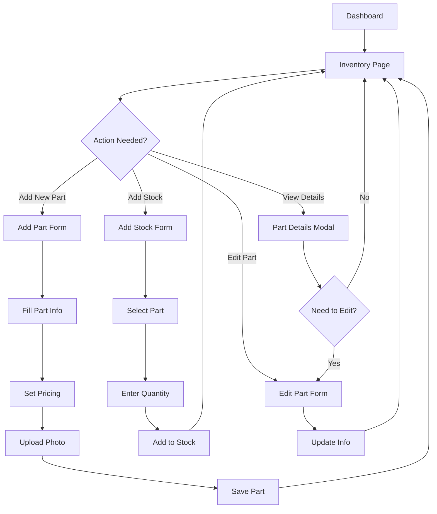
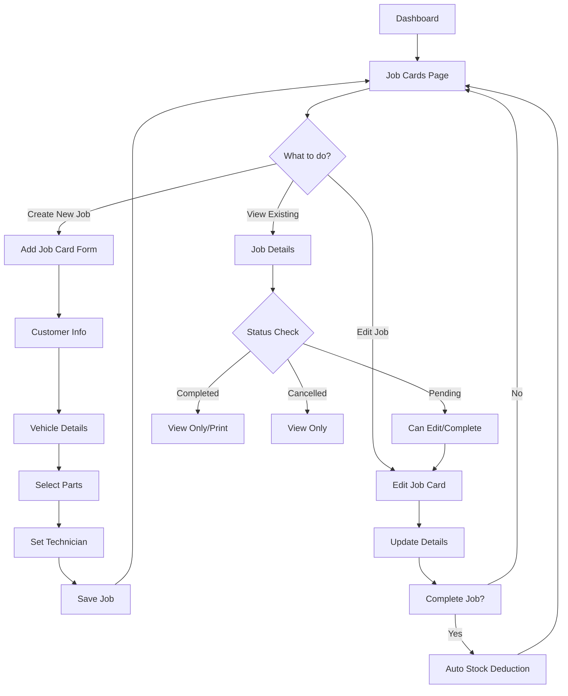
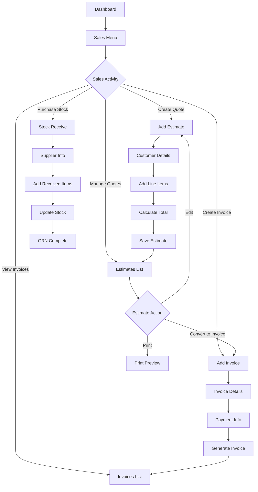

# AutoParts Pro - UI Flow & Interface Guide

## 🎨 Application Layout Structure

```
┌─────────────────────────────────────────────────────────────┐
│                    AutoParts Pro                            │
├─────────────────┬───────────────────────────────────────────┤
│                 │  ☁️ Sync Status                          │
│   Navigation    ├───────────────────────────────────────────┤
│   Sidebar       │                                           │
│                 │            Main Content Area             │
│   📱 Menu Items │                                          │
│   🎨 Theme      │         (Current Page Content)           │
│   🚪 Logout     │                                          │
│                 │                                           │
└─────────────────┴───────────────────────────────────────────┘
```

## 🚀 Main Navigation Flow

### **Primary Menu Structure**

```
🏠 Dashboard (/)
   ├── Overview Stats
   ├── Quick Actions
   └── Recent Activity

📦 Inventory (/inventory)
   ├── Parts List
   ├── Search & Filter
   └── Photo Gallery View

➕ Add Part (/add-part)
   ├── Basic Info Form
   ├── Pricing Setup
   └── Photo Upload

📊 Add Stock (/add-stock)
   ├── Part Selection
   ├── Quantity Entry
   └── Cost Information

📋 Job Cards (/job-cards)
   ├── Active Jobs List
   ├── Job Status Tracking
   └── Customer Details

🚛 Stock History (/stock-movement)
   ├── Movement Log
   ├── Filter by Type
   └── Date Range

⚠️ Low Stock (/low-stock)
   ├── Alert List
   ├── Reorder Suggestions
   └── Quick Restock

📈 Reports (/reports)
   ├── Sales Reports
   ├── Inventory Reports
   └── Performance Metrics

💰 Sales (Dropdown)
   ├── 📄 Estimates (/estimates)
   ├── 🧾 Invoices (/invoices)
   ├── 📥 Stock Receives (/stock-receives)
   └── ➕ New Stock Receive (/stock-receive)
```

## 🔄 User Workflow Patterns

### **1. Inventory Management Flow**



### **2. Job Card Workflow**



### **3. Sales Process Flow**



## 🎯 Key UI Components & Interactions

### **Dashboard Widgets**

```
┌─────────────────┬─────────────────┬─────────────────┐
│  📊 Total Parts │  🔧 Active Jobs │  💰 Revenue     │
│     1,234       │       23        │   LKR 45,000   │
└─────────────────┴─────────────────┴─────────────────┘

┌─────────────────────────────────────────────────────────┐
│  📈 Revenue Chart (Last 7 Days)                        │
│  [Interactive Chart with hover details]                │
└─────────────────────────────────────────────────────────┘

┌─────────────────────────────────────────────────────────┐
│  🎯 Quick Actions                                       │
│  [+ Add Part] [+ New Job] [📊 Reports] [⚠️ Low Stock] │
└─────────────────────────────────────────────────────────┘
```

### **Inventory Table Interface**

```
┌──────────────────────────────────────────────────────────────┐
│  Search: [____________] Filter: [All Types ▼] [🔍 Search]   │
├──────────────────────────────────────────────────────────────┤
│ Photo | Pro No | Part Name        | Stock | Price  | Actions │
├──────────────────────────────────────────────────────────────┤
│ [📷]  | P001   | Engine Oil 5W30  |  25   | 2,500  | [👁️][✏️] │
│ [📷]  | P002   | Brake Pads       |   5   | 4,200  | [👁️][✏️] │
│ [📷]  | P003   | Air Filter       |   0   | 1,800  | [👁️][✏️] │
└──────────────────────────────────────────────────────────────┘
```

### **Modal Interactions**

```
Part Details Modal:
┌─────────────────────────────────────────────────────────┐
│ ✕                    Part Details                       │
├─────────────────────────────────────────────────────────┤
│ Photo: [Large Image with zoom/rotate controls]         │
│ Pro No: P001                                           │
│ Name: Engine Oil 5W30                                  │
│ Stock: 25 units                                        │
│ Location: A1-B2                                        │
│ Prices: Cost: 2,000 | Selling: 2,500 | Final: 2,500  │
│                                                         │
│ [Edit Part] [Add Stock] [View History] [Close]        │
└─────────────────────────────────────────────────────────┘
```

## 🔄 Data Flow in UI

### **Real-time Updates Pattern**

```
User Action → Form Submission → Database Update → UI Refresh → Notification

Example: Adding Stock
1. User clicks "Add Stock" button
2. Modal opens with part selection
3. User selects part and enters quantity
4. Form submits to database
5. Stock levels update in real-time
6. Success notification appears
7. Tables refresh with new data
```

### **Navigation States**

```
Authentication Flow:
┌─────────────┐    ┌─────────────┐    ┌─────────────┐
│   Loading   │ →  │    Login    │ →  │  Main App   │
│   Spinner   │    │    Form     │    │  Interface  │
└─────────────┘    └─────────────┘    └─────────────┘

Theme States:
┌─────────────┐ ⟷ ┌─────────────┐
│ Light Mode  │   │  Dark Mode  │
│ (Default)   │   │  (Toggle)   │
└─────────────┘   └─────────────┘
```

## 📱 Responsive Behavior

### **Sidebar Interaction**
- **Active Page Highlighting**: Current page shown with blue background
- **Dropdown Menus**: Sales section expandable with smooth animation
- **Auto-expansion**: Dropdowns open when child pages are active
- **Theme Toggle**: Switch between light/dark modes
- **Logout Button**: Always accessible at bottom

### **Content Area Features**
- **Sync Status**: Cloud synchronization indicator (top-right)
- **Breadcrumb Navigation**: Clear page location
- **Loading States**: Spinners and skeleton loading
- **Error Boundaries**: Graceful error handling
- **Smooth Animations**: Fade-in effects for page transitions

## 🎮 User Interaction Patterns

### **Common Actions**

```
📋 Create New Item:
Form → Validation → Submit → Database → Success → Redirect

📝 Edit Existing:
Select → Modal/Form → Update → Confirm → Refresh

🔍 Search/Filter:
Input → Real-time filtering → Results update

📊 View Details:
Click → Modal → Display info → Actions available

⚠️ Delete/Cancel:
Click → Confirmation → Action → Update UI

📄 Print/Export:
Select → Generate → Preview → Print/Download
```

### **Keyboard Shortcuts & UX**
- **Tab Navigation**: Full keyboard accessibility
- **Enter to Submit**: Forms respond to Enter key
- **Escape to Close**: Modals close with Escape
- **Auto-focus**: Forms focus first input
- **Loading States**: Prevent double-submission

## 🎯 Complete Page Navigation Map

### **Main Routes & Their Purpose**

| Route | Page | Primary Function | Key Features |
|-------|------|------------------|--------------|
| `/dashboard` | Dashboard | Overview & Quick Actions | Stats, Charts, Recent Activity |
| `/inventory` | Inventory | Parts Management | Search, Filter, Photo View |
| `/add-part` | Add Part | New Part Creation | Form, Photo Upload, Pricing |
| `/add-stock` | Add Stock | Stock Replenishment | Part Selection, Quantity Entry |
| `/job-cards` | Job Cards | Service Management | Job List, Status Tracking |
| `/add-job-card` | Add Job Card | New Job Creation | Customer, Vehicle, Parts Selection |
| `/edit-job-card/:id` | Edit Job Card | Job Modification | Update Details, Complete Job |
| `/stock-movement` | Stock History | Audit Trail | Movement Log, Date Filtering |
| `/low-stock` | Low Stock Alerts | Inventory Alerts | Alert List, Reorder Suggestions |
| `/reports` | Reports | Analytics | Sales, Inventory, Performance |
| `/estimates` | Estimates | Quotations | Quote List, Status Management |
| `/add-estimate` | Add Estimate | Quote Creation | Line Items, Calculations |
| `/invoices` | Invoices | Billing | Invoice List, Payment Tracking |
| `/add-invoice` | Add Invoice | Invoice Creation | Customer Details, Payment Info |
| `/stock-receives` | Stock Receives | Purchase History | GRN List, Supplier Tracking |
| `/stock-receive` | New Stock Receive | Purchase Entry | Supplier Details, Item Addition |

## 🔧 Technical UI Implementation

### **React Component Hierarchy**

```
App.js (Root)
├── ErrorBoundary
├── AuthProvider
├── ThemeProvider
└── Router
    └── AppContent
        ├── Sidebar (Navigation)
        ├── SyncStatus (Cloud Indicator)
        └── Routes (Page Content)
            ├── Dashboard
            ├── Inventory
            ├── AddPart
            ├── JobCards
            └── [Other Pages]
```

### **State Management Flow**

```
Context Providers:
┌─────────────────┐
│   AuthContext   │ → Login/Logout, Session Management
├─────────────────┤
│  ThemeContext   │ → Dark/Light Mode Toggle
└─────────────────┘

Local State:
┌─────────────────┐
│ Component State │ → Form Data, Loading States
├─────────────────┤
│   Modal State   │ → Show/Hide, Selected Items
└─────────────────┘

Database State:
┌─────────────────┐
│  Electron IPC   │ → Database Queries via Main Process
└─────────────────┘
```

### **Event Flow Pattern**

```
User Interaction:
Click/Input → Event Handler → State Update → Database Call → Response → UI Update

Example - Adding New Part:
1. User fills form in AddPart.js
2. onClick triggers handleSubmit()
3. Form validation runs
4. electronAPI.database.query() called
5. Database inserts new part
6. Success notification shown
7. Navigate back to inventory
8. Inventory list refreshes with new part
```

This comprehensive UI flow guide shows exactly how users navigate through the AutoParts Pro interface, complete tasks, and interact with all features of the application.